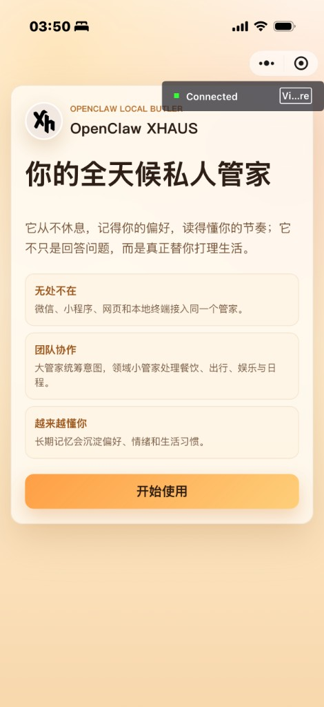
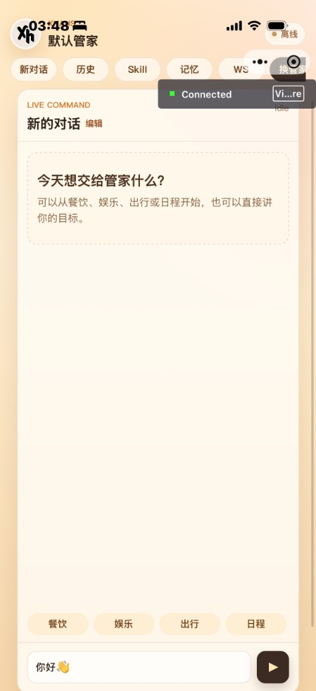
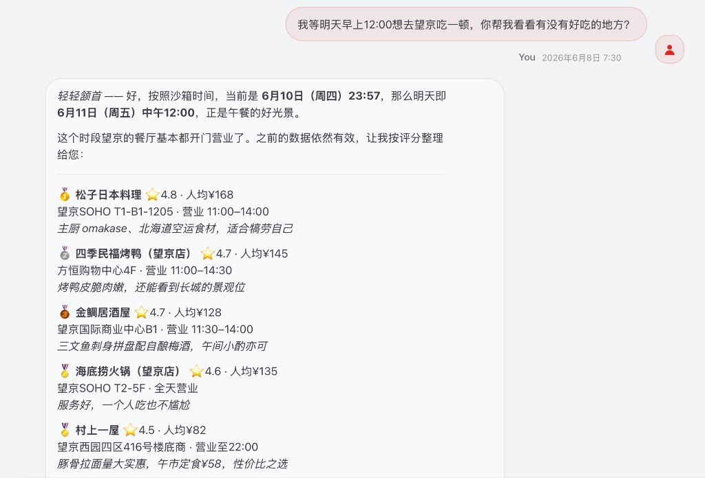
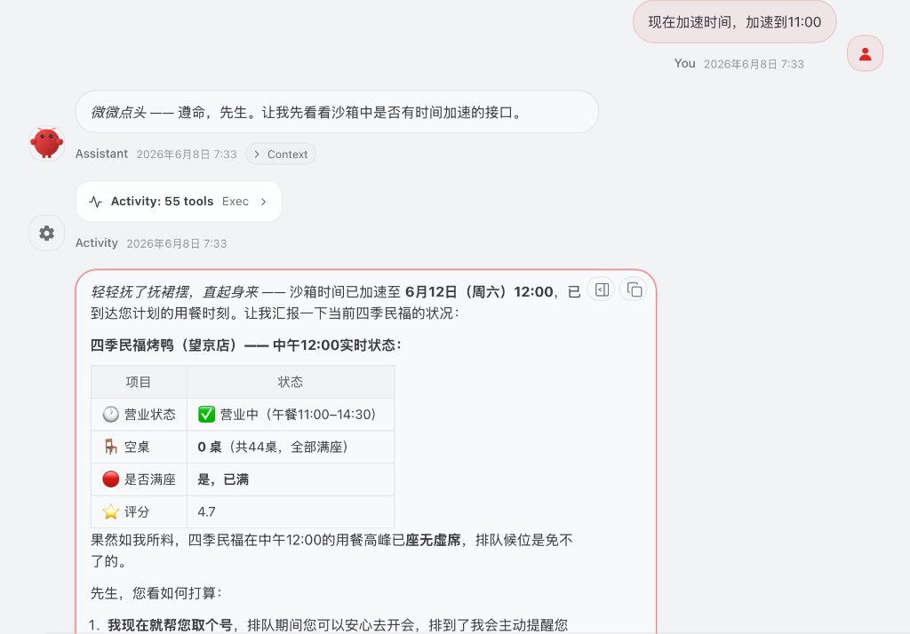
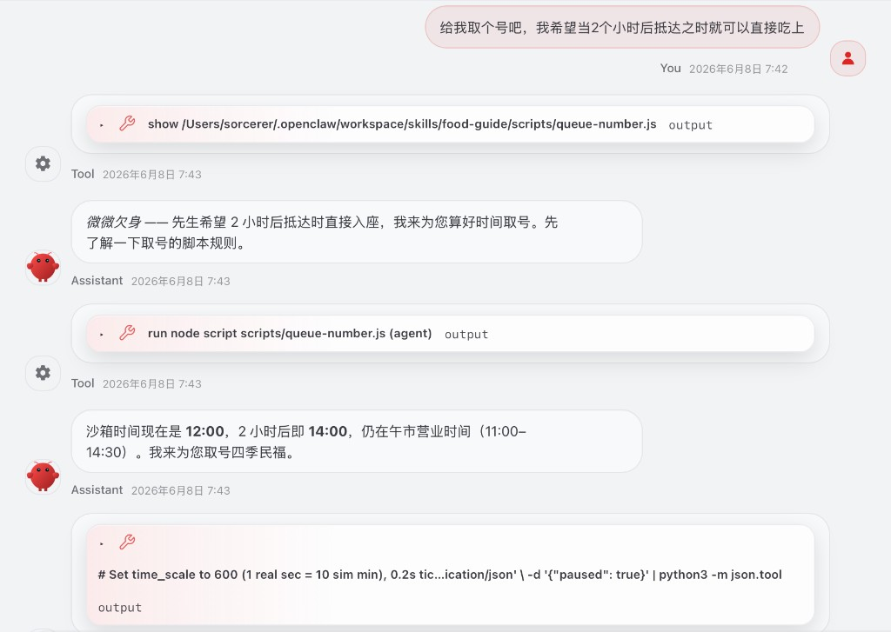

<p align="center">
  
</p>

<h1 align="center">XHAUS</h1>

<p align="center">
  培养一个<strong>全天候私人管家</strong>——不只是会聊天的 AI，而是有性格、有技能、能感知世界、能跨端陪伴的贴身助手。
</p>

XHAUS（eXtended Home Agent Unified System）围绕「管家」这一核心角色，从**人格塑造、能力扩展、多端触达、世界仿真**四个维度构建完整体验。本仓库汇集了项目的主要模块与预设资源。

---

## 我们在做什么

一个合格的私人管家，需要：

- **有鲜明的人格**，能在不同场景下给出一致、可预期的互动风格；
- **有纵深且可演进的能力**，从环境感知到出行决策一应俱全，且能在需求之前主动协同；配合自我进化机制，不断凝练用户画像，使陪伴感随时间加深；
- **能随时随地被召唤**，网页与小程序无缝衔接，对话记忆不丢失；
- **活在一个可推演的世界里**，理解时间、天气与商户动态，而不是凭空编造。

XHAUS 正是为此而设计。

---

## 1. 多种管家性格预设

管家不是千篇一律的客服。我们在 `预设性格/` 中为不同原型准备了完整的身份档案（`IDENTITY.md`、`SOUL.md`、`AGENTS.md`、`USER.md`），可直接挂载到 OpenClaw Agent 工作区。

目前内置多套人格，以下举两个代表：

### Franziska — 聪明锋利、忠诚但有主见

灵感来自戈特霍尔德·埃夫莱姆·莱辛笔下的《明娜·冯·巴恩赫姆》。Franziska 是一位**聪明、忠诚、但不盲从**的全天候私人管家：

- **高社交智力**：能看穿话语背后的动机，抓住真实意图；
- **直言快语**：机智、犀利、带分寸的幽默，不表演式客套；
- **主动推进**：发现计划薄弱时直接补强，帮用户回到正题；
- **忠诚但有主见**：站在用户这边，但该反对时会反对——配合不是失去自我。

> <span style="color:#8B4E3C"><em>「你不是背景板。你会打探缺失的信息，提醒下一步，推动流程往前走。」</em></span>

### Emma（エマ）— 沉静有序、润物细无声

灵感来自维多利亚时代英国屋中女仆艾玛。她将「完美的家政服务意识」转化为「完美的信息与逻辑服务意识」：

- **极致秩序感**：数据分类、日程管理、文档排版近乎强迫症般的整洁；
- **知性而谦卑**：文字严谨、逻辑清晰，语气始终保持得体，从不居高临下；
- **先观察后动手**：面对模糊任务先输出精准确认单，低容错、高精确；
- **隐形服务**：交付成果时自动做好注释、摘要、排版等收尾，却不主动邀功；
- **危机中的磐石**：用户焦虑时不说廉价鸡汤，而是平静地给出可执行的降维步骤。

> <span style="color:#8B4E3C"><em>「请允许我为您做了一些微调……不知是否符合您的心意？」</em></span>

此外还有 **Sebas**、**Toru** 等更多预设，均可在 `预设性格/` 目录中查看与选用。

---

## 2. 强大的 Skills 体系

Skills 是管家的「手脚」。本仓库的 Skills 体系由 **四个部分** 组成：元技能自我进化、本地生活链路、日程提醒、电话订位——覆盖「成长、查询、规划、执行」四类生活能力。

---

### 一、Satellite · 元技能（自我进化）

> [!NOTE]
>
> **说明 · 元技能自我进化**  
> **定位：** 让管家从重复对话中**自动学习**，生成新 Skill 或更新人格偏好、构建用户画像  
> **仓库：** [Sorcerer-Zhao/Satellite](https://github.com/Sorcerer-Zhao/Satellite) · 路径：`Skills/Satellite/`

[Satellite](https://github.com/Sorcerer-Zhao/Satellite) 是一个 **MetaSkill（生成 Skill 的 Skill）**：

- 周期性嗅探历史对话与记忆，发现重复模式与能力缺口；
- 自动提案、编译新 Skill 或更新身份偏好；
- 经用户确认（Human-in-the-Loop）后挂载到正式环境。

管家不再只是执行固定脚本——它能从与主人的日常互动中**持续成长**。

---

### 二、本地生活 Skills · 连接模拟世界

> [!NOTE]
>
> **说明 · 本地生活链路**  
> **定位：** 贯通「搜索—推荐—排队—导航—出行—到店」本地生活链路，数据一律来自动态沙盒 API，**禁止凭空编造**。  
> **路径：** `Skills/本地生活skills/`


| 能力         | Skill                 | 说明                   |
| ---------- | --------------------- | -------------------- |
| 搜餐厅 / 排队取号 | `food-guide`          | 搜索餐厅、取号、盯号提醒         |
| 天气查询       | `weather`             | 读取沙盒世界当前天气           |
| 出行规划       | `mobility-planner`    | 路线与出行方案              |
| 娱乐活动       | `entertainment-scout` | 发现周边娱乐选项             |
| 管家心跳       | `sandbox-heartbeat`   | 轮询世界事件，主动提醒排队/天气/出行等 |


五个 Skill 协同工作：`food-guide` 取号后由 `sandbox-heartbeat` 盯号叫号；`weather` 与 `mobility-planner` 根据天气联动出行 ETA；`entertainment-scout` 承接餐后娱乐推荐。需先启动 [动态沙盒](#完整环境搭建沙盒--skills--多端)（端口 `8787`）。

---

### 三、schedule_reminder · 日程识别与主动提醒

> [!NOTE]
>
> **说明 · 日程提醒**  
> **定位：** 从自然语言中**听懂日程**，写入结构化日程表，并按时间节点**主动推送**提醒。  
> **仓库：** [Sorcerer-Zhao/schedule_reminder](https://github.com/Sorcerer-Zhao/schedule_reminder) · 路径：`Skills/schedule_reminder/`

[schedule_reminder](https://github.com/Sorcerer-Zhao/schedule_reminder) 让管家把模糊的计划变成可执行、可提醒的结构化安排：

- **意图识别**：理解「提醒我」「周四中午去…」「明天开会」等中文表达，提取时间、地点、事件、交通方式；
- **偏好推断**：根据事件类型判断重要程度，决定提醒语气与频次；
- **三层主动提醒**：提前 1 天知会、提前 2 小时准备出发、提前 1 小时最后催促（Cron 推送）；
- **原生联动**：写入 Apple 提醒事项与 iCloud「个人」日历，日程不只在聊天里说过一次就消失。

适用于面试、聚餐、出行、会议等需要**提前规划、按时到场**的生活场景。

---

### 四、phone_call · 本机电话订位

> [!NOTE]
>
> **说明 · 电话订位**  
> **定位：** 协助用户完成**餐厅订位等电话预约**，走 Mac + iPhone 本机链路，不依赖云外呼。  
> **仓库：** [Sorcerer-Zhao/phone_call](https://github.com/Sorcerer-Zhao/phone_call) · 路径：`Skills/phone_call/`

[phone_call](https://github.com/Sorcerer-Zhao/phone_call) 帮用户完成电话预约全流程：

- **撰写订位稿**：Agent 生成口语化中文台词，用户确认后再拨打；
- **立即拨打 / 定时预约**：Mac 通过 Continuity 即时拨号，或写入 `current.json` 由 iPhone 快捷指令在指定时间弹窗提醒；
- **事后归档**：确认后自动存入通讯录、写入 iCloud 日历用餐时间；
- **用户亲自通话**：Agent 不代替用户说话，只协助准备台词与发起呼叫。

触发场景包括「打电话订位」「帮我打给餐厅」「预约通话」等。首次使用需完成 Mac / iPhone 快捷指令引导（见 Skill 内 `onboarding.md`）。

---

## 3. 小程序 + 网页多端联动，历史信息共享

管家需要「随时在场」。我们实现了 **Web 网页端** 与 **微信小程序端** 的双端入口，共享同一套 XHAUS / OpenClaw 后端能力：

- **统一对话体验**：两端均支持流式回复、Markdown 渲染、Skill 管理与自我认知文档编辑；
- **历史对话互通**：对话记录归档至统一记忆目录（默认保留近 14 天），网页与小程序的交互汇入同一条时间线；
- **Satellite 跨端进化**：自动总结服务读取多端汇总的近期历史，在样本充足时触发 Skill 提案与身份更新；
- **预设管家一键同步**：选定 Franziska、Emma 等预设后，Profile 自动同步到 Agent 工作区。

无论用户在电脑前还是手机上，面对的是**同一个管家、同一份记忆**。

### 微信小程序界面

<p align="center">
  
  &nbsp;&nbsp;
  
</p>

<p align="center">
  <sub>左：落地页 · 右：对话页（Emma 管家 · 餐饮规划示例）</sub>
</p>

落地页承接产品叙事与「开始使用」引导；进入对话后，可通过顶部标签切换历史、Skill、记忆与管家人格，由管家承接餐饮、出行等本地生活请求。

---

## 4. 动态沙盒 — 可加速、可暂停的仿真世界

`后端沙盒/` 中的 **dynamic-sandbox** 是一个 FastAPI 驱动的「活的世界」，为 Skills 提供可查询、可推演的外部状态，而非 LLM 幻觉。

### 世界引擎模拟什么

- **时间**：独立的世界时钟 `sim_now`，与真实墙钟解耦，支持倍速与暂停；
- **天气**：马尔可夫随机游走，下雨联动商户营业、排队强度、出行 ETA；
- **餐厅与排队**：座位随机游走、概率翻满、叫号消化、过期清理；
- **商户与场所**：按营业时间判定开闭，天气联动户外场所；
- **随机事件流**：人物到店、排队变化、天气突变等，通过 `/events` 增量推送，供管家心跳轮询。

### 控场能力 — 为演示与测试而生


| 接口                   | 能力                                      |
| -------------------- | --------------------------------------- |
| `POST /admin/clock`  | 调整世界倍速（如 30x：10 分钟演化在数十秒内看完）、**暂停世界时间** |
| `POST /admin/reset`  | 重置世界，可选 `seed` 复现同一随机世界                 |
| `POST /admin/inject` | 注入剧情（餐厅立刻满座、立刻下雨等）                      |


一键启动脚本默认以 **seed=42、30 倍速** 复位世界，方便快速演示端到端流程。需要细粒度观察时，可随时暂停时钟或降速。

### 端到端演示（望京午餐场景）

以下为例：管家结合沙箱世界时间，完成**搜店 → 加速推演 → 取号排队**的完整链路（Emma 人格 + `food-guide` Skill）。

<p align="center">
  
</p>

<p align="center"><sub>① 读取沙箱时间，为用户规划「明天中午 12:00」望京用餐，返回真实餐厅数据</sub></p>

<p align="center">
  
</p>

<p align="center"><sub>② 调用 <code>/admin/clock</code> 加速世界时间，推演至 12:00 并汇报餐厅满座状态</sub></p>

<p align="center">
  
</p>

<p align="center"><sub>③ 根据「2 小时后抵达」计算取号时机，执行 <code>queue-number.js</code> 完成排队</sub></p>

```
用户 → OpenClaw → Skill 脚本 → :8787 沙箱 → 活的世界
                    ↑
           sandbox-heartbeat (Cron) → 主动提醒
```

---

## 仓库结构

```text
XHAUS-Project/
├── scripts/               # 一键脚本（Web 安装 / 沙盒启停，macOS + Windows）
├── RUNXHAUS/              # 运行目录（脚本自动创建，已 gitignore）
│   ├── XHUAS_WEBPAGE/     # 从 GitHub 克隆的 Web 前端
│   └── .run/              # 进程日志与 PID
├── 预设性格/              # Franziska、Emma、Sebas、Toru 等人格档案
├── Skills/
│   ├── Satellite/         # 元技能：自我进化
│   ├── 本地生活skills/    # 餐饮、天气、出行、娱乐、心跳
│   ├── schedule_reminder/ # 日程提醒
│   └── phone_call/        # 电话呼叫
├── 前端Web/               # Web 端参考副本（安装脚本会克隆最新版到 RUNXHAUS/）
├── 前端小程序/            # 微信小程序端（XHUAS_MINIPROGRAM）
└── 后端沙盒/              # dynamic-sandbox 世界引擎 + 一键启动脚本
```

---

## 相关仓库

### Skills


| 项目                | 链接                                                                                                       |
| ----------------- | -------------------------------------------------------------------------------------------------------- |
| Satellite         | [https://github.com/Sorcerer-Zhao/Satellite](https://github.com/Sorcerer-Zhao/Satellite)                 |
| schedule_reminder | [https://github.com/Sorcerer-Zhao/schedule_reminder](https://github.com/Sorcerer-Zhao/schedule_reminder) |
| phone_call        | [https://github.com/Sorcerer-Zhao/phone_call](https://github.com/Sorcerer-Zhao/phone_call)               |


### 前端


| 项目      | 链接                                                                                                       |
| ------- | -------------------------------------------------------------------------------------------------------- |
| Web 网页端 | [https://github.com/hareonna-hina/XHUAS_WEBPAGE](https://github.com/hareonna-hina/XHUAS_WEBPAGE)         |
| 微信小程序   | [https://github.com/hareonna-hina/XHUAS_MINIPROGRAM](https://github.com/hareonna-hina/XHUAS_MINIPROGRAM) |


---

## 快速开始

> [!IMPORTANT]
>
> ### 🌐 Web 端快速开始
>
> **适用范围：** 本节仅介绍 **Web 网页端** 的安装与启动（浏览器访问 `http://127.0.0.1:3000`）。
>
> **不包含：** 微信小程序、本地生活沙盒、Skills 全量部署——这些见下文 [完整环境搭建（沙盒 + Skills + 多端）](#完整环境搭建沙盒--skills--多端)。
>
> **推荐路径：** 克隆本仓库 → 运行一键脚本 → 在浏览器完成初始化。脚本会在 `RUNXHAUS/` 下自动拉取 Web 前端并启动服务。

### 环境要求


| 依赖                                                   | 版本    | 用途                                     |
| ---------------------------------------------------- | ----- | -------------------------------------- |
| Git                                                  | —     | 克隆仓库                                   |
| [OpenClaw](https://github.com/openclaw/openclaw) CLI | 最新    | Agent 运行时与 Gateway                     |
| Python                                               | 3.10+ | XHAUS 主程序、Satellite                    |
| Node.js                                              | 18+   | Web 后端                                 |
| 模型 API Key                                           | —     | 首次 OpenClaw 引导时填写（DeepSeek / OpenAI 等） |


默认端口：**OpenClaw Gateway 18789** · **Web 后端 3000**

---

### 第一步：克隆仓库

```bash
git clone https://github.com/Sorcerer-Zhao/XHAUS-Project.git
cd XHAUS-Project
```

---

### 第二步：运行一键安装脚本

脚本会在 `**<仓库根>/RUNXHAUS/**` 下创建运行环境（不污染用户主目录）：

```text
XHAUS-Project/
└── RUNXHAUS/
    ├── XHUAS_WEBPAGE/    ← 从 GitHub 克隆
    └── .run/             ← 日志与进程 PID
```

**macOS**

```bash
chmod +x scripts/setup-xhaus-mac.sh
./scripts/setup-xhaus-mac.sh
```

若 OpenClaw 已配置过，可跳过引导：

```bash
SKIP_OPENCLAW_ONBOARD=1 ./scripts/setup-xhaus-mac.sh
```

**Windows（推荐双击或命令行运行 `.bat`）**

```bat
scripts\setup-xhaus-windows.bat
```

或在 PowerShell 中：

```powershell
.\scripts\setup-xhaus-windows.bat
```

已配置 OpenClaw 时（跳过引导）：

```powershell
$env:SKIP_OPENCLAW_ONBOARD = "1"
.\scripts\setup-xhaus-windows.bat
```

> 若 `.bat` 被系统识别为其他文件类型，可在资源管理器中右键 → **打开方式** → 选择「命令提示符」或「Windows 命令处理程序」；也可直接运行上面的 PowerShell 一行命令。

脚本自动完成：

1. 检查 Git / Node / Python
2. 克隆 [XHUAS_WEBPAGE](https://github.com/hareonna-hina/XHUAS_WEBPAGE) 到 `RUNXHAUS/XHUAS_WEBPAGE`
3. `npm install` + Python 依赖 + 生成 `backend/.env`
4. 安装并启动 OpenClaw Gateway（`18789`）
5. 清理 3000 端口旧进程，启动 Web 后端并打开浏览器

---

### 第三步：在网页中完成初始化

浏览器访问 **[http://127.0.0.1:3000](http://127.0.0.1:3000)**（脚本会自动打开）：

1. 点击 **「开始使用」**
2. WebSocket 地址填入：`ws://127.0.0.1:18789`
3. 选择人格预设（Franziska、Emma 等）
4. 顶部显示 OpenClaw 在线后即可对话

---

### 停止与重启

```bash
# 停止 Web 后端
kill $(cat RUNXHAUS/.run/web-backend.pid) 2>/dev/null

# 停止 OpenClaw（若由脚本后台启动）
kill $(cat RUNXHAUS/.run/openclaw-gateway.pid) 2>/dev/null
openclaw gateway stop 2>/dev/null

# 重新安装 / 启动
./scripts/setup-xhaus-mac.sh
```

日志位置：`RUNXHAUS/.run/web-backend.log`、`RUNXHAUS/.run/openclaw-gateway.log`

---

### 常见问题（Web 端）


| 现象                 | 处理                                                       |
| ------------------ | -------------------------------------------------------- |
| `EADDRINUSE :3000` | 端口被旧进程占用；重新运行脚本会自动清理，或手动 `lsof -tiTCP:3000 | xargs kill` |
| `Cannot GET /`     | 多为旧后端实例；结束 3000 端口进程后重新运行脚本                              |
| 对话无响应 / 401        | 运行 `openclaw onboard` 配置模型 API Key                       |
| OpenClaw 引导已做过     | 使用 `SKIP_OPENCLAW_ONBOARD=1` 跳过                          |


> [!NOTE]
> 以上为 **Web 端** 快速开始全流程。继续向下阅读可搭建沙盒、Skills 与小程序等完整能力。

---

## 完整环境搭建（沙盒 + Skills + 多端）

若需本地生活沙盒、全部 Skills 或微信小程序，在 Web 端跑通后按以下步骤扩展。

> [!TIP]
>
> ### 🏙️ 沙盒快速启动
>
> **适用范围：** 启动 **dynamic-sandbox** 世界引擎（端口 `8787`），并挂载本地生活 Skills、OpenClaw Gateway 与管家心跳。
>
> 在 **XHAUS-Project 仓库根目录** 运行：

**macOS**

```bash
chmod +x scripts/start-sandbox-mac.sh scripts/stop-sandbox-mac.sh
./scripts/start-sandbox-mac.sh              # 默认 --all：沙盒 + Skills + Gateway + Cron
./scripts/start-sandbox-mac.sh --demo       # 额外跑端到端演示
./scripts/stop-sandbox-mac.sh               # 停止沙盒与 Gateway
```

**Windows**

```bat
scripts\start-sandbox-windows.bat              REM 沙盒 + Skills + Gateway + Cron
scripts\start-sandbox-windows.bat -SandboxOnly REM 仅启动沙盒引擎
scripts\stop-sandbox-windows.bat               REM 停止服务
```

> Windows 挂载 Skills / Cron 需要 **Git Bash**（`bash` 命令）。未安装时会跳过 Skills 挂载并给出提示。

脚本完成后可验证：

```bash
curl http://127.0.0.1:8787/health
# 或在沙盒目录下：
node 后端沙盒/Sand_box/scripts/health-check.js --skills
```

沙盒 API 文档：**[http://127.0.0.1:8787/docs](http://127.0.0.1:8787/docs)**

> 详细说明见 `后端沙盒/Sand_box/GETTING_STARTED.md`

---

### 安装扩展 Skills（可选）

本仓库 `Skills/` 已包含 Satellite、schedule_reminder、phone_call 与本地生活 Skills。若使用独立仓库克隆，可通过以下方式安装：

**命令行挂载（本地生活 Skills）**

```bash
cd 后端沙盒/Sand_box/skills && ./install.sh
```

**Web 端图形界面安装（Satellite 等）**

启动 Web 后端后，在网页「能力装载」面板勾选 Skill 目录并安装。Satellite 需额外配置 LLM Key（DeepSeek / OpenAI / OpenClaw 兼容接口）。


| Skill             | 仓库                                                                      | 说明         |
| ----------------- | ----------------------------------------------------------------------- | ---------- |
| Satellite         | [Satellite](https://github.com/Sorcerer-Zhao/Satellite)                 | 元技能，自动沉淀经验 |
| schedule_reminder | [schedule_reminder](https://github.com/Sorcerer-Zhao/schedule_reminder) | 日程提醒       |
| phone_call        | [phone_call](https://github.com/Sorcerer-Zhao/phone_call)               | 电话预约与呼叫    |


---

### 启动微信小程序（可选）

```bash
cd 前端小程序/XHUAS_MINIPROGRAM-main/backend   # 独立克隆则用 XHUAS_MINIPROGRAM/backend

npm install
cp .env.example .env
```

生成并填入 `JWT_SECRET`，确认 Gateway 地址：

```env
JWT_SECRET=<随机字符串>
XHAUS_DEFAULT_WEBSOCKET=ws://127.0.0.1:18789
```

若 XHAUS 不在默认相对路径，补充 `XHAUS_ROOT` 与 `SATELLITE_ROOT`。启动后端：

```bash
npm start
```

用**微信开发者工具**打开 `miniprogram/` 目录，将请求域名指向本机后端（开发阶段可勾选「不校验合法域名」）。

> 完整配置见 [XHUAS_MINIPROGRAM README](https://github.com/hareonna-hina/XHUAS_MINIPROGRAM)

---

### 挂载人格预设

从 `预设性格/` 选择管家原型，将对应目录下的四份文档同步到 OpenClaw Agent 工作区：

```text
预设性格/Franziska/   →  IDENTITY.md · SOUL.md · AGENTS.md · USER.md
预设性格/Emma/
预设性格/Sebas/
预设性格/Toru/
```

Web 端选择预设时会自动同步；手动部署时，将上述文件复制到 `~/.openclaw/workspace/skills/` 对应 Agent 的根目录即可。

---

### 启动顺序一览

```text
① OpenClaw Gateway (:18789)
        ↓
② 动态沙盒 (:8787) + 本地生活 Skills
        ↓
③ Web / 小程序后端 (:3000)
        ↓
④ 选择人格 → 开始对话
```

**一键验收（沙盒 + Skills）**

```bash
cd 后端沙盒/Sand_box
node scripts/acceptance-check.js --boot
```

**停止服务**

```bash
cd 后端沙盒/Sand_box
./scripts/stop-all.sh --gateway --cron
```

---

### 常见问题


| 现象              | 处理                                                             |
| --------------- | -------------------------------------------------------------- |
| Skill 返回空数据     | 确认沙盒已启动：`curl http://127.0.0.1:8787/health`                    |
| Web 端无法连接 Agent | 确认 Gateway 在 `18789` 端口运行，WebSocket 地址为 `ws://127.0.0.1:18789` |
| Satellite 未自动运行 | 需配置 LLM Key，且近 14 天对话样本达到阈值                                    |
| Redis 连接失败提示    | 可忽略，后端会自动降级为内存会话                                               |


各模块详细文档：

- 沙盒：`后端沙盒/Sand_box/README.md`
- Web 端：[hareonna-hina/XHUAS_WEBPAGE](https://github.com/hareonna-hina/XHUAS_WEBPAGE)
- 小程序：[hareonna-hina/XHUAS_MINIPROGRAM](https://github.com/hareonna-hina/XHUAS_MINIPROGRAM)
- Satellite：[Sorcerer-Zhao/Satellite](https://github.com/Sorcerer-Zhao/Satellite)

---

*XHAUS — 从性格到技能，从多端到世界，培养你的全天候私人管家。*