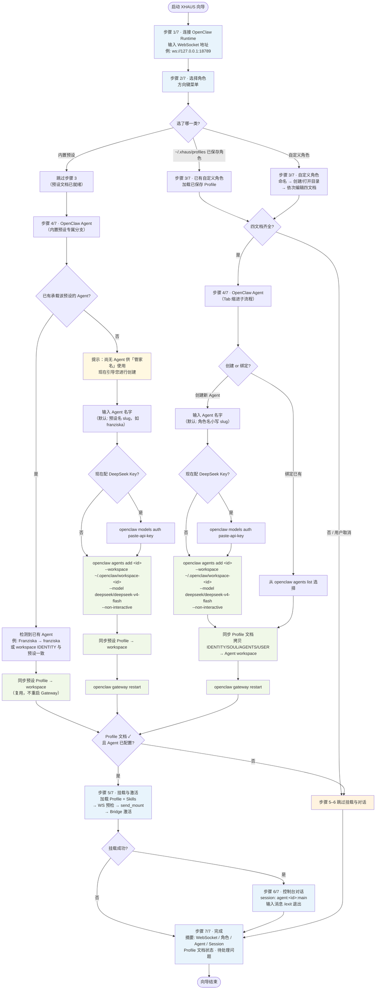
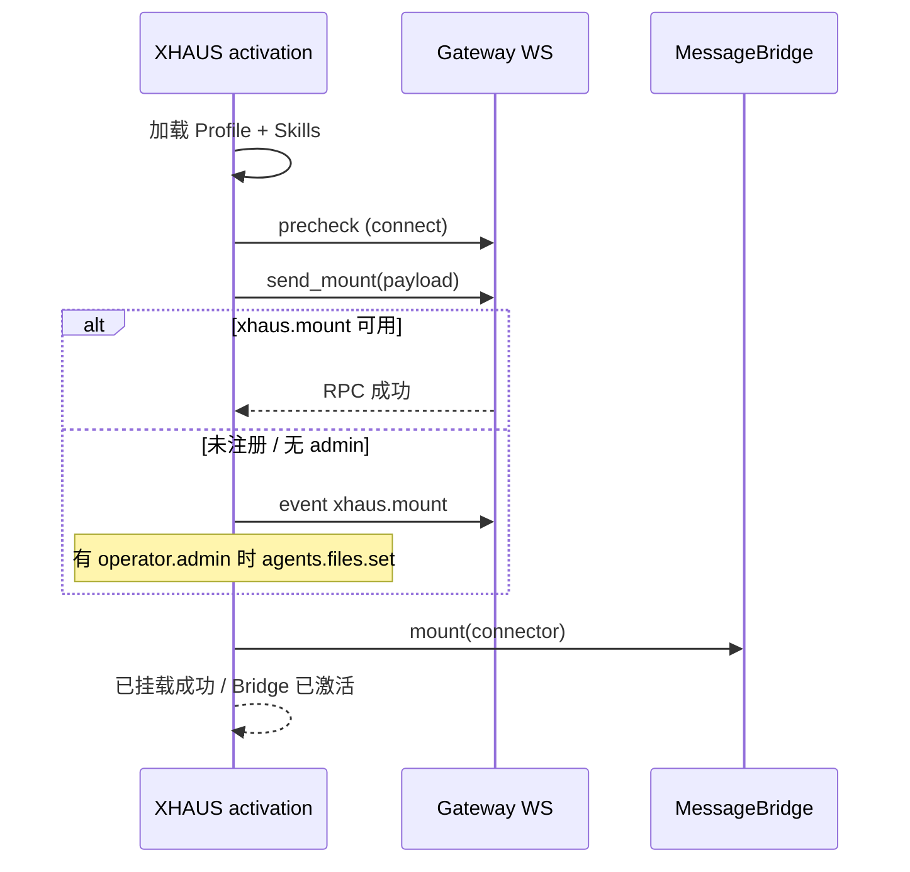

# XHAUS

**Persona & Skills Runtime Bridge** — 连接前端与 [OpenClaw](https://github.com/Sorcerer-Zhao/XHAUS) Gateway 的中转框架。

XHAUS **不是**聊天客户端，也不是 Agent 本体或推理层。它负责：

- 加载并校验 **Profile**（人格四文档）
- 扫描本地 **Skills**（`SKILL.md`）
- 通过 **OpenClaw CLI** 创建/绑定 Agent，并将 Profile 同步到 Agent 工作区
- 通过 **WebSocket** 与 OpenClaw Gateway 预检、打包、挂载
- 提供 **控制台对话** 与可扩展的 **MessageBridge** 中转接口（CLI / Web / App 可接入）

```
Frontend (CLI / Web / App)
        │
        ▼
   MessageBridge
        │
        ▼
 OpenClawWebSocketConnector  ──►  OpenClaw Gateway (WS v4)
                                        │
                                        ▼
                              agent:<id>:main  (按 Agent ID 路由)
```

## 功能概览

| 能力 | 说明 |
|------|------|
| 7 步交互向导 | `python3 main.py` — 连接、选角、Profile、Agent、挂载、对话、摘要 |
| OpenClaw Agent 开通 | `openclaw agents add` → 拷贝 Profile 到 workspace → `gateway restart` |
| 控制台对话 | 挂载成功后进入 `chat.send` 流式对话（session: `agent:<id>:main`） |
| 连接预检 | `connect.challenge` → `connect` → `hello-ok` |
| Profile 加载 | `IDENTITY.md` · `SOUL.md` · `AGENTS.md` · `USER.md` |
| Skills 扫描 | 递归查找 `SKILL.md`，合并为注入载荷 |
| 统一挂载 | RPC `xhaus.mount` → 事件广播 → `agents.files.set`（按权限回退） |
| Bridge 激活 | 成功后输出「已挂载成功 / Bridge 已激活」 |
| 核心与 CLI 解耦 | 编排逻辑在 `xhaus.core.activation`，向导仅调用 API |

## 环境要求

- Python **3.10+**
- 已安装 **OpenClaw CLI**（`openclaw` 命令可用）
- 运行中的 **OpenClaw Gateway**（默认 `ws://127.0.0.1:18789`）
- 依赖见 [`requirements.txt`](requirements.txt)

## 安装

```bash
git clone https://github.com/Sorcerer-Zhao/XHAUS.git
cd XHAUS
pip install -r requirements.txt
```

## 快速开始

### 1. 配置 Gateway 认证（二选一）

```bash
export OPENCLAW_GATEWAY_TOKEN='你的-gateway-token'
```

或确保 `~/.openclaw/openclaw.json` 中存在 `gateway.auth.token`（XHAUS 会自动读取）。

向导中选择的 **Agent ID** 会用于挂载与对话路由。也可通过环境变量覆盖默认值：

```bash
export XHAUS_AGENT_ID=hausmeister   # 仅影响未在向导中指定时的回退
```

### 2. 启动交互向导

```bash
python3 main.py
```

向导共 **7 步**，完整决策树见下文 [CLI 引导决策树](#cli-引导决策树)。

### 3. 非交互冒烟测试

```bash
python3 examples/mvp_activate.py \
  --url ws://127.0.0.1:18789 \
  --preset default_butler
```

## CLI 引导决策树

`python3 main.py` 启动后，按以下分支推进。菱形为判断，矩形为动作，圆角为步骤起止。



### 步骤速查

| 步骤 | 名称 | 自定义 / 已保存路径 | 内置预设路径 |
|------|------|---------------------|--------------|
| 1 | 连接 Runtime | 输入 WebSocket URL | 同左 |
| 2 | 选择角色 | 预设 / 已保存 / 新建 | 同左 |
| 3 | Profile 文档 | 编辑或加载四文档 | **跳过**（预设文档已打包） |
| 4 | OpenClaw Agent | 创建或绑定 + 同步 + 重启 Gateway | **检测已有 Agent** → 有则复用同步；无则引导创建（强制创建分支，不再手填任意 ID） |
| 5 | 挂载与激活 | 需「文档完整 + Agent 已配置」 | 同左 |
| 6 | 控制台对话 | 挂载成功后进入 | 同左 |
| 7 | 完成 | 输出摘要 | 同左 |

### 内置预设的 Agent 检测（步骤 4）

选择内置预设（如 Franziska、默认管家）时，XHAUS 在 OpenClaw 中查找**已承载该预设人格**的 Agent，满足任一即视为「已有」：

1. **规范 ID 匹配** — 存在 id 为预设名 slug 的 Agent（`Franziska` → `franziska`），且 workspace 四文档齐全  
2. **内容匹配** — 任意 Agent 的 workspace 中 `IDENTITY.md` 与预设目录一致  

| 检测结果 | 行为 |
|----------|------|
| 已有 | 同步预设 Profile 到该 Agent workspace，跳过创建，**不**重启 Gateway |
| 尚无 | 提示「尚无 Agent 供『管家名』使用」，进入**强制创建**流程（`agents add` → 同步 → `gateway restart`） |

### Profile 与 Agent 状态（独立判定）

向导在步骤 7 **分开显示**两项状态，避免混淆：

- **Profile 文档**：四份 `.md` 是否齐全（与 Agent 配置无关）
- **OpenClaw Agent**：`agents add` / 绑定 + 文档同步是否成功

仅当两者均就绪时，才会执行步骤 5–6。

## OpenClaw Agent 与 Profile 同步

开通 Agent 时，XHAUS 执行与手动操作等价的流水线：

```bash
# 1. 创建 Agent（向导中可自动执行）
openclaw agents add franziska \
  --workspace ~/.openclaw/workspace-franziska \
  --model deepseek/deepseek-v4-flash \
  --non-interactive

# 2. 同步 Profile（向导自动拷贝）
# ~/.xhaus/profiles/<name>/  →  ~/.openclaw/workspace-<id>/

# 3. 让 Gateway 发现新 Agent
openclaw gateway restart

# 4. （可选）DeepSeek API Key
openclaw models auth --agent franziska paste-api-key --provider deepseek
```

**为何用文件拷贝而非 Gateway API？**

| 方式 | 时机 | 说明 |
|------|------|------|
| **拷贝到 workspace** | 步骤 4 开通 Agent | OpenClaw 从磁盘读取四文档；不依赖 Token；与 CLI 行为一致 |
| **`agents.files.set`** | 步骤 5 挂载回退 | 需 WebSocket + `operator.admin`；适合运行时热更新 |

步骤 5 仍会尝试 `xhaus.mount` → 事件广播 → `agents.files.set`，作为挂载时的二次同步。

## 挂载流程



**挂载策略（由强到弱）：**

1. `xhaus.mount` — Gateway 原生 RPC（待 OpenClaw 侧实现）
2. `xhaus.mount` **事件** — 向已连接客户端广播载荷
3. `agents.files.set` — 需要 Token 授予 `operator.admin`
4. **degraded** — 预检通过、载荷已准备，但无法写入 Agent 文件

## 目录结构

```
XHAUS/
├── main.py                 # 入口
├── requirements.txt
├── examples/               # 演示脚本
│   ├── mvp_activate.py     # 非交互激活
│   ├── chat_demo.py        # 控制台对话示例
│   ├── bridge_demo.py      # MessageBridge + Stub
│   ├── load_profile_demo.py
│   └── load_skills_demo.py
└── xhaus/
    ├── cli/                # 向导、菜单、对话、Agent 开通
    │   ├── wizard.py       # 7 步引导主流程
    │   ├── agent_setup.py  # OpenClaw Agent 子流程
    │   └── chat.py         # 控制台对话
    ├── config/             # Profile 加载与校验
    ├── skills/             # Skills 扫描与注册
    ├── core/
    │   ├── activation.py   # MVP 编排（与 CLI 解耦）
    │   ├── openclaw_agent.py  # openclaw CLI 封装与 Profile 同步
    │   ├── payload.py      # Profile + Skills 统一载荷
    │   ├── chat/           # 对话 session
    │   ├── bridge/         # MessageBridge、FrontendAdapter
    │   └── connector/      # Gateway WS、设备身份、OpenClaw 连接器
    └── templates/
        ├── profiles/presets/   # 内置角色预设
        └── skills/             # 本地技能目录（内容默认不入库）
```

## Profile

每个 Profile 目录包含四个 Markdown 文件：

| 文件 | 用途 |
|------|------|
| `IDENTITY.md` | 身份 / 对外形象 |
| `SOUL.md` | 性格、原则 |
| `AGENTS.md` | Agent 行为与工具约定 |
| `USER.md` | 用户画像与偏好 |

**内置预设：** `xhaus/templates/profiles/presets/<name>/`  
可选 `preset.meta.json` 提供菜单显示名。

**自定义 / 已保存：** `~/.xhaus/profiles/<name>/`  
向导中新建的角色会出现在步骤 2 菜单（显示为「角色名（我的管家）」）。

## Skills

技能以目录 + `SKILL.md` 形式存在。

### XHAUS 扫描源（挂载载荷 / 元数据）

扫描顺序（先发现者优先）：

1. `xhaus/templates/skills/`（项目内置，含 Satellite 等）
2. `~/.xhaus/skills/`（可选，目录不存在时不报警）
3. 环境变量 `XHAUS_SKILLS_DIR` 指向的目录

```bash
export XHAUS_SKILLS_DIR=/path/to/my-skills
```

### OpenClaw Agent 如何用到这些 Skills

OpenClaw **从 Agent 工作区的 `skills/` 目录**加载可调用技能，而不是直接读 XHAUS 模板路径。

开通 Agent（步骤 4）或挂载激活（步骤 5）时，XHAUS 会**符号链接**（不拷贝）：

```
~/.openclaw/workspace-<agent>/skills/Satellite  →  xhaus/templates/skills/Satellite
~/.openclaw/workspace-<agent>/skills/...         →  ~/.xhaus/skills/...（若有）
```

因此预设管家与自定义管家共用同一份 `templates/skills` 源文件，不重复占用磁盘。若 `skills/<名>` 已是真实目录（非链接），则保留原样并提示。

### 安装 Skill 速览

- **本地自建** — XHAUS 根目录 `python3 install_skill.py` → 见 [安装本地 Skill](#安装本地-skillinstall_skillpy)
- **云端 ClawHub / Git** — 主向导步骤 4 开通 Agent 后，用 `openclaw skills install` 或对话交给 OpenClaw → 见 [安装云端 Skill](#安装云端-skill)

**已有 Agent（如 emma）**：重新跑向导步骤 4 或步骤 5 挂载时会自动补链；也可手动：

```bash
python3 -c "
from pathlib import Path
from xhaus.skills.workspace_link import link_skills_into_workspace
r = link_skills_into_workspace(Path('~/.openclaw/workspace-emma').expanduser())
print('linked:', r.linked, 'warnings:', r.warnings, 'errors:', r.errors)
"
```

## 环境变量

| 变量 | 说明 |
|------|------|
| `OPENCLAW_GATEWAY_TOKEN` | Gateway 认证 Token（优先于配置文件） |
| `XHAUS_AGENT_ID` | 未在向导指定时的 Agent ID 回退（默认 `hausmeister`） |
| `XHAUS_SKILLS_DIR` | 额外 Skills 根目录 |
| `XHAUS_PROFILES_DIR` | 自定义 Profile 根目录（默认 `~/.xhaus/profiles`） |
| `NO_COLOR` | 禁用 CLI 颜色 |
| `XHAUS_FORCE_ARROW_MENU` | 强制使用方向键菜单 |

## 编程接口

核心激活（无需 CLI）：

```python
from xhaus.core.activation import activate_xhaus

result = activate_xhaus(
    websocket_url="ws://127.0.0.1:18789",
    preset_name="default_butler",
    profile_ok=True,
    agent_id="hausmeister",
)
print(result.report())
```

OpenClaw Agent 开通（无需向导）：

```python
from pathlib import Path
from xhaus.core.openclaw_agent import provision_agent_for_profile

result = provision_agent_for_profile(
    profile_name="Toru",
    profile_dir=Path.home() / ".xhaus/profiles/Toru",
    mode="create",
    agent_id="toru",
    restart_gateway=True,
)
```

前端中转（预留，无完整聊天 UI）：

```python
from xhaus.core.bridge import MessageBridge, CallbackFrontendAdapter

bridge = MessageBridge()
bridge.register_frontend(CallbackFrontendAdapter(on_inbound=print))
# bridge.mount(connector) ...
```

## 示例脚本

```bash
python3 examples/load_profile_demo.py
python3 examples/load_skills_demo.py
python3 examples/bridge_demo.py
python3 examples/chat_demo.py
python3 examples/mvp_activate.py --help
```

## 常见问题

**步骤 7 显示 Profile 不完整，但四份文档都写了**  
「Profile 文档」与「OpenClaw Agent」分开显示。文档齐全而 Agent 未配置时，只会标记 Agent 未就绪，不会误判文档缺失。

**`pairing required` / 设备未批准**  
这不是 WSL/Windows 适配问题，而是 **OpenClaw 的安全机制**：控制台对话（步骤 6）用 `cli` 设备身份连接，每台新电脑都要在 Gateway 上**批准一次**。步骤 5 挂载可能仍成功（仅用 Token 预检）。

向导步骤 6 检测到该错误时会自动进入**设备配对引导**（尝试 `openclaw devices approve --latest`）。也可手动执行：

```bash
openclaw devices approve --latest --url ws://127.0.0.1:18789
```

Gateway 在远程/WSL 宿主机时，在**能管理 Gateway 的那一侧**执行，且 WebSocket 地址须填可达的 IP（不要误用另一端的 `127.0.0.1`）。

**中文输入回退后发送内容不对**  
控制台对话使用 `prompt_toolkit` 行编辑（替代原生 `input()`），避免中文 IME 下退格时「屏幕所见」与「实际发送」不一致。请执行 `pip install -r requirements.txt` 确保已安装。

**`missing scope: operator.admin`**  
当前 Token 无管理员权限时，步骤 5 会走降级挂载（预检 + 事件广播）。步骤 4 的 Profile 同步走文件拷贝，不依赖此权限。

**`openclaw agents add` 后 Dashboard 看不到 Agent**  
向导会在创建后执行 `openclaw gateway restart`。若手动创建，请自行重启 Gateway。

**`skills 目录不存在，已跳过`**  
默认 `~/.xhaus/skills/` 为可选目录，不存在时不再警告。需要自定义技能时创建该目录并放入 `SKILL.md` 即可。

**`src refspec main does not match any`**  
尚未创建任何 commit。先执行 `git add .` 与 `git commit`，再 `git push`。

## 边界说明

- ✅ Profile / Skills 加载、校验、打包、WS 挂载、Bridge 状态机、控制台对话、OpenClaw Agent 开通  
- ❌ 完整图形聊天 UI、模型推理、Skills 执行引擎、OpenClaw 全协议实现  

## 安装本地 Skill：`install_skill.py`

项目根目录下的 **`install_skill.py`** 用于把**本机自建的 skill 项目**安装进共享目录 `~/.xhaus/skills/`，并让所有 OpenClaw 管家都能通过符号链接使用，无需给每个 workspace 各拷一份。

### 适用场景

| 类型 | 做法 |
|------|------|
| **本地自建 skill**（含 `SKILL.md` 的文件夹） | 在 XHAUS 根目录运行 `python3 install_skill.py` |
| **ClawHub / GitHub 云端 skill** | 先完成主向导步骤 4 开通 Agent，再用 `openclaw skills install` 或对话交给 OpenClaw（见 [安装云端 Skill](#安装云端-skill)） |

### 快速开始

```bash
cd /path/to/XHAUS
python3 install_skill.py
```

无参数时进入 **3 步 CLI 引导**：

| 步骤 | 内容 |
|------|------|
| 1/3 说明 | 介绍共享目录 `~/.xhaus/skills/<skill名>/` 与云端 skill 的区别 |
| 2/3 项目目录 | 输入本地 skill 文件夹路径（根目录须有 `SKILL.md`）；可拖入文件夹 |
| 3/3 复制并同步 | 复制到共享目录，并同步到各 OpenClaw Agent |

若共享目录已有同名 skill，会询问是否覆盖。

### 安装时自动完成的操作

1. **复制** — 将项目文件复制到 `~/.xhaus/skills/<skill名>/`（跳过 `.git`、`node_modules` 等）
2. **符号链接信任** — 在 `~/.openclaw/openclaw.json` 的 `skills.load.allowSymlinkTargets` 中加入 `~/.xhaus/skills` 与 `templates/skills`
3. **链接到各管家** — 为每个 Agent 的 `workspace-*/skills/<skill名>` 创建指向共享目录的符号链接
4. **重启 Gateway** — 执行 `openclaw gateway restart`，使 OpenClaw 重新扫描技能

### 命令行参数

```bash
# 跳过引导，直接指定目录
python3 install_skill.py ~/projects/my-skill

# 覆盖已存在的同名 skill
python3 install_skill.py ~/projects/my-skill --force

# 只复制/链接，不重启 Gateway
python3 install_skill.py ~/projects/my-skill --no-restart

# 查看 ClawHub / Git 云端 skill 安装说明
python3 install_skill.py --cloud-help
```

### 路径输入提示

macOS 下将文件夹**拖入终端**时，常会带上前导 `'` 且可能缺少闭合引号。脚本会自动清理引号并解析为绝对路径，可直接拖入，例如：

```text
项目目录: '/Users/me/skills/test1
```

无需手动删引号。

### 目录结构要求

```
my-skill/
├── SKILL.md          # 必需
└── skill.meta.json   # 可选
```

安装成功后，预设管家与自定义管家的 OpenClaw workspace 均通过链接访问同一份 skill，修改 `~/.xhaus/skills/` 中的源文件即可（OpenClaw 是否热加载取决于其 `skills.load.watch` 配置）。

### 与主向导的关系

- **`python3 main.py`** — 完整 7 步：连接、选角、Profile、Agent、挂载、对话  
- **`python3 install_skill.py`** — 仅安装/更新共享 skill，可在任意时刻单独运行  

新建 skill 后运行 `install_skill.py`，再进入主向导或重新挂载，各管家即可调用该 skill。

## 安装云端 Skill

ClawHub、GitHub 等**云端 skill**不由 XHAUS 的 `install_skill.py` 处理。正确时机是：**先通过 XHAUS 主向导创建并开通 OpenClaw Agent**（步骤 4 完成、`openclaw gateway restart` 之后），再把安装需求交给 **OpenClaw 自己**完成。

### 推荐流程

```
XHAUS 主向导 (python3 main.py)
  → 步骤 4：创建 / 绑定 OpenClaw Agent ✓
  → 步骤 5–6：挂载、对话（可选，用于确认 Agent 在线）
        ↓
直接向 OpenClaw 提需求（CLI 或对话）
  → 安装 ClawHub / Git 上的 skill
```

### 方式一：OpenClaw CLI（最直接）

在终端指定目标 Agent（`--agent` 与向导里创建的 id 一致，如 `emma`、`franziska`）：

```bash
# 搜索 ClawHub
openclaw skills search <关键词>

# 从 ClawHub 安装到该 Agent
openclaw skills install <slug> --agent <agent-id>

# 从 Git 仓库安装
openclaw skills install git:https://github.com/<org>/<repo>.git --agent <agent-id>

# 安装到 OpenClaw 共享托管目录（多 Agent 可用）
openclaw skills install <slug> --global

# 查看已加载技能
openclaw skills list --agent <agent-id>
openclaw skills check --agent <agent-id>
```

安装后若未立即生效，可执行：

```bash
openclaw gateway restart
```

### 方式二：在控制台对话里交给 OpenClaw

完成 XHAUS 向导步骤 6 进入对话后，用自然语言说明需求即可，例如：

```text
你: 请从 ClawHub 安装 xxx 这个 skill，并配置到我的 workspace。
你: 请用 git:https://github.com/... 安装 skill，slug 设为 my-skill。
```

由已开通的 OpenClaw Agent 按自身能力执行安装与配置；XHAUS 只负责连接与路由（`agent:<id>:main`），不参与云端 skill 的下载逻辑。

### 本地 vs 云端对照

| | 本地自建 skill | 云端 skill（ClawHub / Git） |
|---|---|---|
| **工具** | `python3 install_skill.py` | `openclaw skills install …` 或对话中说明 |
| **前提** | 本机已有含 `SKILL.md` 的目录 | OpenClaw Agent 已创建且 Gateway 在运行 |
| **落盘位置** | `~/.xhaus/skills/` + workspace 符号链接 | OpenClaw 托管目录 / Agent workspace（由 OpenClaw 决定） |
| **XHAUS 是否参与** | 是（复制、信任、链接、重启） | 否（创建完 Agent 后交给 OpenClaw） |

### 文档

- OpenClaw Skills CLI：<https://docs.openclaw.ai/cli/skills>
- XHAUS 内快速查看云端说明：`python3 install_skill.py --cloud-help`

## License

暂未指定开源协议；如需二次分发请先与仓库所有者确认。
